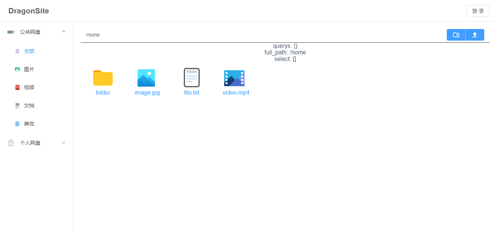

# ReadMe

**开发中。。。**

## 运行脚本

* 打包： `cd web && npm build`
* 启动服务器：`cd .. && set FLASK_ENV=development && flask run`
* 创建用户：`flask user add 'username' 'passward' --admin`
* 删除用户：`flask user drop 'username'`
* 数据库：`flask db init; flask db migrate; flask db upgrade`

## TODO

* docker
* add user cli
