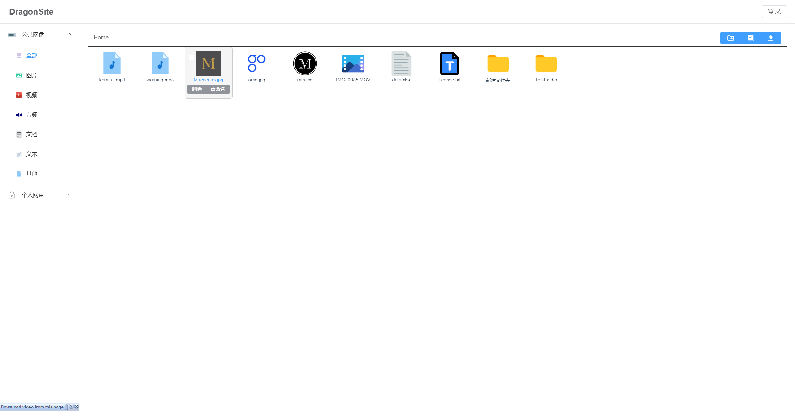

# DragonSite2

Vue + Fastapi(py3.9)构建的网盘服务

## 功能

- 文件批量上传
- 文件下载
- 在线预览（目前仅支持图片、视频预览）
- 文件分类查看
- 多用户支持
- 使用文件的md5值去重保存

## 启动方法

1. 前端项目构建

    - 在[release](https://github.com/Dragon-GCS/DragonSite-vue/releases)下载编译好的前端文件，解压根目录下的`dist/`。
    - 本地编译：`cd web && npm install && npm build`。
    > 编译时如果遇到`elementUI`的报错：`Property 'class' does not exist on type 'IntrinsicAttributes'`，打开报错的文件删掉对应的一行代码即可）

2. 启动服务

    - 创建并激活虚拟环境（可选）
    - 使用`pip install .`安装依赖
    - 仅启动`fastapi`服务：`uvicorn server:app`或`python -m server [-h host] [-p port]`，默认地址为"127.0.0.1:8000"
    - 启动前后端服务: `python main.py [-h host] [-p port]`，默认地址为"0.0.0.0:8000"

3. 使用docker

    - 在docker-compose.yaml中配置环境变量
    - 运行`docker compose up -d`，需要`nginx`和`python:slim`两个镜像，如果`docker-compose`拉取失败需要手动拉取

4. 用户管理
    - 创建用户：`python manage.py user add <username> <password> [--admin]`
    - 删除用户：`python manage.py user drop <username>`

5. 相关配置

    - 前端配置在`./web/src/config.ts`中，后端配置在`./server/config.py`
    - DEBUG模式（目前开启时无法代理前端文件，将`main.py`中的路由复制到`server/__init__.py`中可以正常代理前端路由）：设置环境变量`DEBUG`为任意值开启uvicorn的debug模式
    - 本项目使用orm，使用环境变量`DATABASE_URL`配置数据库连接，默认为`sqlite3:///<root>/db.sqlite`，debug模式会使用`test.sqlite`
    - 使用其他数据库需要安装相应的后端，目前`ormar`支持`ormar[postgresql]`、`ormar[mysql]`和`ormar[sqlite]`（默认）
    - 所有上传的文件保存在根目录下`files`文件中

6. 环境变量
    - `DEBUG`：开启debug模式
    - `DATABASE_URL`：数据库url，默认为`sqlite:///<root>/db.sqlite`
    - `APP_KEY`：个人密钥，用于加密用户密码，默认*1234567890*

## TODO

- 支持文件、文件夹移动
- 增加可预览文件类型，PDF、Markdown、纯文本、Word、Excel、PPT等
